# CDK Error Handling & Bootstrap Improvements

This document explains the enhanced CDK bootstrap process that gracefully handles existing resources and common CDK errors.

## The Problem We Fixed

CDK bootstrap was failing with these common errors:

```
ROLLBACK_COMPLETE: Resource handler returned message: 
- "*** already exists (Service: S3, Status Code: 0)"
- "Tag parameters are invalid (Service: Ecr, Status Code: 400)"  
- "Error occurred during operation 'PutParameter'"
```

**Root Cause**: CDK bootstrap assumed it was creating everything from scratch, but some resources already existed or had conflicting configurations.

## The Solution

### ✅ Enhanced Bootstrap Process

The workflow now includes intelligent error handling:

1. **🔍 Pre-flight Checks**: Detects failed CDKToolkit stacks
2. **🧹 Automatic Cleanup**: Removes `ROLLBACK_COMPLETE` and failed stacks
3. **🎯 Smart Fallback**: Tries existing bucket first, falls back to auto-generated
4. **🏷️ Fixed Tags**: Uses simplified tags that pass ECR validation
5. **📋 Full Logging**: Clear visibility into what's happening

### 🔄 Bootstrap Flow

```mermaid
graph TD
    A[Start Bootstrap] --> B{Check CDKToolkit Stack}
    B -->|ROLLBACK_COMPLETE| C[Delete Failed Stack]
    B -->|CREATE_FAILED| C
    B -->|Healthy| D[Continue]
    B -->|Not Found| D
    
    C --> E[Wait for Deletion]
    E --> D
    
    D --> F{Your Bucket Exists?}
    F -->|Yes| G[Try Bootstrap with Your Bucket]
    F -->|No| H[Use CDK Auto-Generated Bucket]
    
    G -->|Success| I[✅ Done]
    G -->|Fails| J[Clean Up & Fallback]
    J --> H
    H --> I
```



## What's Now Handled Automatically

### 🚫 S3 Bucket Conflicts
- **Before**: `*** already exists (Service: S3)` → Failure
- **After**: Tries your bucket first, falls back to CDK-generated bucket

### 🏷️ Tag Validation Issues  
- **Before**: `Tag parameters are invalid (Service: Ecr)` → Failure
- **After**: Uses simplified, ECR-compatible tags

### 🔧 Failed Stack States
- **Before**: Manual deletion required from AWS Console
- **After**: Automatically detects and cleans up failed stacks

### 📊 Parameter Conflicts
- **Before**: `Error occurred during operation 'PutParameter'` → Failure  
- **After**: Forces updates and handles existing parameters

## Manual Cleanup Tool

For existing failed stacks, use the cleanup script:

```bash
# Check what would be cleaned up
./scripts/cleanup-cdk-bootstrap.sh --dry-run

# Clean up failed CDKToolkit stack
./scripts/cleanup-cdk-bootstrap.sh

# Force cleanup without confirmation
./scripts/cleanup-cdk-bootstrap.sh --force

# Different region
./scripts/cleanup-cdk-bootstrap.sh --region us-east-1
```

### Script Features

- ✅ **Safe**: Checks stack status before acting
- ✅ **Smart**: Only deletes failed stacks, leaves healthy ones alone
- ✅ **Interactive**: Confirms actions unless `--force` is used
- ✅ **Dry-run**: Preview mode to see what would happen

## Example Workflow Run

Here's what you'll see in GitHub Actions now:

```
✅ Checking for existing CDKToolkit stack...
✅ Found failed CDKToolkit stack in state: ROLLBACK_COMPLETE. Deleting it...
✅ Waiting for stack deletion to complete...
✅ CDKToolkit stack deleted successfully
✅ Starting CDK bootstrap...
✅ Bucket dev-octonius-assets-566545930933-eu-central-1 exists, bootstrapping with existing bucket...
✅ Bootstrap completed successfully with bucket: dev-octonius-assets-566545930933-eu-central-1
```

Or if your bucket doesn't exist:

```
✅ Bucket dev-octonius-assets-566545930933-eu-central-1 not found. Using CDK auto-generated bucket...
✅ CDK created bucket: cdk-hnb659fds-assets-566545930933-eu-central-1
✅ Bootstrap completed successfully with bucket: cdk-hnb659fds-assets-566545930933-eu-central-1
```

## Benefits

### 🛡️ **Fault Tolerant**
- Handles existing resources gracefully
- Automatically recovers from failures
- No more manual intervention needed

### 🔄 **Idempotent**  
- Can run multiple times safely
- Detects and reuses existing resources
- Always reaches a consistent final state

### 📊 **Transparent**
- Clear logging of all actions
- Shows which bucket is actually being used
- Easy to debug if issues occur

### ⚡ **Fast Recovery**
- Automatic cleanup of failed attempts
- No waiting for manual intervention
- Continuous deployment pipeline keeps working

## Migration Guide

### If You Have a Failed Stack Right Now

1. **Option 1**: Use the cleanup script
   ```bash
   ./scripts/cleanup-cdk-bootstrap.sh
   ```

2. **Option 2**: Manual cleanup via AWS CLI
   ```bash
   aws cloudformation delete-stack --stack-name CDKToolkit --region eu-central-1
   aws cloudformation wait stack-delete-complete --stack-name CDKToolkit --region eu-central-1
   ```

3. **Option 3**: Run your deployment workflow - it will handle cleanup automatically

### For Future Deployments

Nothing to change! The enhanced bootstrap process is now part of your deployment workflow and will handle all edge cases automatically.

## Troubleshooting

### Stack Still Failing?

1. **Check the logs** - The workflow now provides detailed logging
2. **Verify permissions** - Ensure your IAM policies include CloudFormation delete permissions
3. **Run cleanup script** - Use `./scripts/cleanup-cdk-bootstrap.sh --dry-run` to see what's happening

### Deployment Tracking Issues?

The system now dynamically determines which bucket is actually being used, so deployment tracking will work regardless of whether you're using your custom bucket or a CDK-generated one.

### Different Behavior?

- **Bucket names might change**: If your custom bucket doesn't exist, CDK will create one with its naming pattern
- **Deployment manifests**: Will be stored in whatever bucket actually gets used
- **Tracking still works**: The deployment tracker script automatically detects the correct bucket

## Why This Approach?

You asked a great question: "why can't we handle the cdk errors, like if something is existing then we shouldn't fail, no?"

**You're absolutely right!** Infrastructure-as-Code tools should be idempotent and handle existing resources gracefully. Unfortunately:

1. **CDK limitations**: CDK bootstrap isn't fully idempotent out of the box
2. **CloudFormation constraints**: CF has limitations around resource updates
3. **Service differences**: Each AWS service has different behavior for existing resources

Our solution provides the robustness that CDK bootstrap should have natively, while maintaining full compatibility with CDK's expectations.

## Future Improvements

This enhanced bootstrap process opens up possibilities for:

- **🔄 Blue/green deployments**: Easier environment swapping
- **📦 Multi-region support**: Consistent bootstrap across regions  
- **🔐 Custom KMS keys**: Environment-specific encryption
- **📊 Enhanced monitoring**: Better visibility into bootstrap health

The infrastructure is now much more resilient and developer-friendly! 