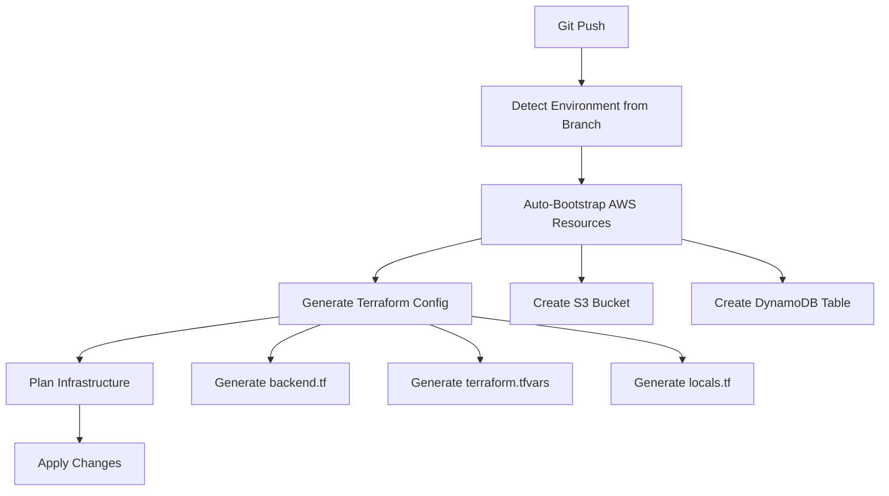

# 🚀 DevOps Guide - 100% Pipeline-Native Terraform Infrastructure

Welcome to the Octonius Platform DevOps Guide! This guide covers our **100% pipeline-native, branch-based infrastructure** deployment system using Terraform.

## 🎯 Overview

Our infrastructure system is **100% pipeline-native** - everything is computed directly in the CI/CD pipeline using standard tools with **zero external scripts**. Environments are automatically detected from branch names, AWS resources are bootstrapped automatically, and all configurations are generated on-the-fly.

### ✨ Key Features

- **🌿 Branch-Based Environments**: Automatic environment detection from branch names
- **🔧 100% Pipeline-Native**: Zero external scripts - everything uses standard CI/CD tools
- **🏗️ Auto-Bootstrap**: S3 buckets and DynamoDB tables created automatically
- **💰 Cost Optimized**: Smart resource allocation based on environment type
- **🔒 Secure by Default**: Encrypted state, secure networking, proper tagging

## 🌲 Branch to Environment Mapping

| Branch Pattern | Environment | Use Case | Infrastructure |
|----------------|-------------|----------|---------------|
| `master` | `prod` | Production | High availability, multiple AZs |
| `development` | `dev` | Development | Cost-optimized, single NAT |
| `feature/*` | `feature-{name}` | Feature development | Minimal, temporary |
| `hotfix/*` | `hotfix-{name}` | Critical fixes | Isolated testing |
| Other branches | `{branch-name}` | Custom environments | Configurable |

## 🚀 Quick Start

### 1. Set Environment Variables

Configure these in your GitHub repository:

```bash
# Required Secrets (Repository Settings → Secrets and variables → Actions → Secrets)
AWS_ACCESS_KEY     # AWS access key
AWS_SECRET_KEY     # AWS secret key  
DEV_S3_BUCKET      # Dev S3 bucket name
PROD_S3_BUCKET     # Prod S3 bucket name

# Required Variables (Repository Settings → Secrets and variables → Actions → Variables)
AWS_ACCOUNT_ID     # Your AWS account ID
AWS_REGION         # AWS region (e.g., eu-central-1)
AWS_ROLE_NAME      # IAM role name
DEV_CLOUDFRONT_ID  # Dev CloudFront distribution ID
PROD_CLOUDFRONT_ID # Prod CloudFront distribution ID
REPO_NAME          # Repository name
```

### 2. Deploy via CI/CD (Zero Setup!)

Simply push to your branch - everything happens automatically:

```bash
# Push to master → auto-deploys to prod (with S3/DynamoDB auto-created)
git checkout master
git push origin master

# Push to development → plans for dev (with S3/DynamoDB auto-created)
git checkout development
git push origin development

# Push to feature branch → plans for feature environment (with S3/DynamoDB auto-created)
git checkout feature/user-auth
git push origin feature/user-auth
```

**That's it!** 🎉 The pipeline automatically:
- Detects environment from branch name
- Creates S3 bucket and DynamoDB table if they don't exist
- Generates all Terraform configurations
- Plans and applies infrastructure changes

## 🏗️ Architecture

### 100% Pipeline-Native Flow



### What Gets Auto-Created

For every environment, the pipeline automatically uses/creates:

- **S3 Bucket**: Uses existing buckets from environment variables
  - `prod` environment → `$PROD_S3_BUCKET`
  - `dev` environment → `$DEV_S3_BUCKET`
  - Feature branches → `$DEV_S3_BUCKET` (different key paths)
- **DynamoDB Table**: `{env}-octonius-terraform-locks-{region}`
  - LockID primary key
  - Minimal capacity (cost-optimized)
  - Proper tagging
  - **Created automatically** if it doesn't exist

### Infrastructure Components

Each environment automatically provisions:

- **VPC & Networking**: Environment-specific CIDR ranges
- **Security Groups**: Properly configured firewall rules  
- **State Management**: Isolated S3 bucket and DynamoDB table
- **Tagging**: Comprehensive resource tagging for management

## 🛠️ Configuration System

### Environment-Specific Settings

**Production (`prod`)**:
- VPC CIDR: `10.0.0.0/16`
- Subnets: Multiple AZs for high availability  
- NAT Gateway: Multiple for redundancy
- Cost: Higher (optimized for availability)

**Development (`dev`)**:
- VPC CIDR: `10.1.0.0/16`
- Subnets: Multi-AZ with cost optimization
- NAT Gateway: Single instance
- Cost: Medium (balanced)

**Feature Branches (`feature-*`)**:
- VPC CIDR: `10.{hash}.0.0/16` (auto-computed unique ranges)
- Subnets: Minimal viable setup
- NAT Gateway: Single instance  
- Cost: Low (minimal resources)

### Dynamic Resource Naming

Resources follow a consistent naming pattern:

```
{environment}-{project}-{resource}-{region}
```

Examples:
- `prod-octonius-terraform-state-eu-central-1`
- `dev-octonius-terraform-locks-eu-central-1`
- `feature-user-auth-vpc`

## 🔄 CI/CD Integration

### GitHub Actions Workflow

The pipeline is **completely self-contained** with **zero external scripts**:

1. **Detects Environment**: From branch name using simple bash logic
2. **Auto-Bootstraps AWS**: Creates S3 bucket and DynamoDB table if needed
3. **Generates Config**: Backend and variables using heredoc
4. **Plans/Applies**: Standard Terraform workflow

### Workflow Triggers

```yaml
on:
  push:
    branches: 
      - master        # → prod environment (auto-deploy)
      - development   # → dev environment (plan only)
      - 'feature/*'   # → feature-{name} environment (plan only)
      - 'hotfix/*'    # → hotfix-{name} environment (plan only)

workflow_dispatch:  # Manual deployment with environment override
```

### Branch-Based Deployment Strategy

| Branch | Trigger | Action | Environment |
|--------|---------|--------|-------------|
| `master` | Push | Auto-apply | `prod` |
| `development` | Push | Plan only | `dev` |
| `feature/*` | Push | Plan only | `feature-{name}` |
| Manual | Dispatch | Configurable | Any |

## 🔐 Security Best Practices

### State Management Security

- **Encryption**: All state files encrypted at rest
- **Access Control**: IAM-based access to state bucket
- **Versioning**: Full version history for rollbacks
- **Locking**: DynamoDB prevents concurrent modifications

### Network Security

- **Private Subnets**: Database and application tiers isolated
- **Security Groups**: Principle of least privilege
- **NAT Gateways**: Secure outbound internet access
- **VPC Isolation**: Complete network separation per environment

### Resource Tagging

All resources are automatically tagged:

```hcl
common_tags = {
  Environment = local.environment
  Project     = local.project_name
  ManagedBy   = "terraform"
  Repository  = local.repo_name
  Branch      = local.environment
  Account     = local.account_id
  Region      = local.aws_region
}
```

## 💰 Cost Optimization

### Environment-Based Scaling

- **Production**: Optimized for performance and availability
- **Development**: Balanced cost vs. functionality
- **Feature Branches**: Minimal resources, easy cleanup

### Resource Lifecycle

- **Automatic Cleanup**: Feature environments can be easily destroyed
- **Smart Provisioning**: Only necessary resources per environment
- **Cost Monitoring**: Comprehensive tagging for cost tracking

### Cost Estimation

GitHub Actions automatically estimates costs for infrastructure changes:

```bash
# Cost estimation runs on pull requests automatically
# Shows cost breakdown per environment type
# Warns if costs exceed thresholds
```

## 🚨 Troubleshooting

### Common Issues

#### 1. AWS Credentials Error

```bash
Error: AccessDenied
```

**Solution**: Check your GitHub secrets:
- `AWS_ACCESS_KEY`
- `AWS_SECRET_KEY`
- `AWS_ACCOUNT_ID`
- `AWS_REGION`

#### 2. Environment Detection Issues

Check your branch naming:
```bash
# Good branch names
master, development, feature/user-auth, hotfix/critical-bug

# Avoid special characters that don't translate well
feature/user@auth, feature/user#123
```

#### 3. State Bucket Access Error

```bash
Error: bucket does not exist
```

**Solution**: Check your existing S3 buckets and GitHub secrets:
- Ensure `PROD_S3_BUCKET` and `DEV_S3_BUCKET` secrets are set correctly
- Verify the buckets actually exist in your AWS account
- Check AWS permissions for S3 and DynamoDB access
- Verify region settings match

#### 4. Empty Bucket Configuration Error

```bash
Error: Invalid Value - The value cannot be empty or all whitespace
  on backend.tf line 6, in terraform:
   6:     bucket         = ""
```

**Solution**: This means your S3 bucket secrets are not set:

1. **Check your GitHub repository secrets**:
   - Go to Settings → Secrets and variables → Actions → Secrets
   - Verify these secrets exist and have values:
     - `DEV_S3_BUCKET` (for dev/feature environments)
     - `PROD_S3_BUCKET` (for production environment)

2. **Verify secret values**:
   ```bash
   # Your secrets should contain actual S3 bucket names like:
   # DEV_S3_BUCKET = "my-company-dev-terraform-state"
   # PROD_S3_BUCKET = "my-company-prod-terraform-state"
   ```

3. **Check bucket permissions**:
   - Ensure the buckets exist in your AWS account
   - Verify your AWS credentials have access to these buckets

### Debug Mode

Enable verbose logging:

```bash
export TF_LOG=DEBUG
terraform plan
```

### Manual Recovery

If you need to run Terraform manually:

```bash
# Manual deployment (if needed)
ENV="prod"  # or dev, feature-xyz
case "$ENV" in
  prod) BUCKET="your-prod-s3-bucket" ;;
  *) BUCKET="your-dev-s3-bucket" ;;
esac

# Generate backend configuration (normally done by pipeline)
cat > terraform/backend.tf << EOF
terraform {
  backend "s3" {
    bucket         = "$BUCKET"
    key            = "terraform/$ENV/terraform.tfstate"
    region         = "eu-central-1"
    encrypt        = true
    dynamodb_table = "$ENV-octonius-terraform-locks-eu-central-1"
  }
}
EOF

cd terraform && terraform init && terraform apply
```

## 🔄 Advanced Workflows

### Multi-Region Deployment

Deploy to multiple regions by setting different `AWS_REGION` values:

```bash
# Update AWS_REGION variable in repository settings
# Push to deploy to new region
```

### Environment Promotion

Promote changes through environments:

```bash
# Deploy to dev first
git checkout development
git push origin development

# Review, then promote to prod
git checkout master  
git merge development
git push origin master  # Auto-deploys to prod
```

### Feature Environment Cleanup

Clean up feature environments when done:

```bash
# Via GitHub Actions (manual dispatch)
# Action: destroy
# Environment: feature-user-auth

# Or locally (manual)
cd terraform
terraform destroy -auto-approve
```

## 🎯 Key Advantages

### ✅ **100% Pipeline-Native**

- **Zero Scripts**: No custom scripts to maintain
- **Standard Tools**: Uses bash, AWS CLI, Terraform - no magic
- **Self-Contained**: Pipeline has everything it needs
- **Transparent**: All logic visible in the workflow
- **Debuggable**: Easy to test and troubleshoot

### ✅ **Auto-Bootstrap**

- **Uses Existing S3 Buckets**: No need to create buckets - uses your `PROD_S3_BUCKET` and `DEV_S3_BUCKET`
- **Auto-Creates DynamoDB Tables**: State locking tables created automatically if needed
- **Idempotent**: Safe to run multiple times
- **Fault-Tolerant**: Handles existing resources gracefully
- **Cost-Optimized**: Minimal capacity settings for DynamoDB

### ✅ **Developer Experience**

- **Zero Setup**: Developers just push to branches
- **Automatic**: Environment detection and configuration
- **Isolated**: Each branch gets its own infrastructure
- **Cost-Aware**: Smart resource allocation

## 📚 Additional Resources

- [Terraform Best Practices](https://www.terraform.io/docs/cloud/guides/recommended-practices/index.html)
- [AWS Well-Architected Framework](https://aws.amazon.com/architecture/well-architected/)
- [GitHub Actions Documentation](https://docs.github.com/en/actions)

## 🎯 Quick Reference

### Required Environment Variables

```bash
# GitHub Repository Settings → Secrets and variables → Actions

# Secrets tab:
AWS_ACCESS_KEY      # Your AWS access key
AWS_SECRET_KEY      # Your AWS secret key
AWS_REGION          # AWS region (e.g., eu-central-1)
DEV_S3_BUCKET       # Dev S3 bucket
PROD_S3_BUCKET      # Prod S3 bucket

# Variables tab:
AWS_ACCOUNT_ID      # Your AWS account ID
AWS_ROLE_NAME       # IAM role name
DEV_CLOUDFRONT_ID   # Dev CloudFront ID
PROD_CLOUDFRONT_ID  # Prod CloudFront ID
REPO_NAME           # Repository name
```

### Essential Commands

```bash
# Deploy (automatic)
git push origin BRANCH_NAME

# Manual deployment (if needed)
ENV="prod"  # or dev, feature-xyz
case "$ENV" in
  prod) BUCKET="your-prod-s3-bucket" ;;
  *) BUCKET="your-dev-s3-bucket" ;;
esac

# Generate backend configuration (normally done by pipeline)
cat > terraform/backend.tf << EOF
terraform {
  backend "s3" {
    bucket         = "$BUCKET"
    key            = "terraform/$ENV/terraform.tfstate"
    region         = "eu-central-1"
    encrypt        = true
    dynamodb_table = "$ENV-octonius-terraform-locks-eu-central-1"
  }
}
EOF

cd terraform && terraform init && terraform apply
```

---

**100% Pipeline-Native!** 🚀 Zero scripts, zero complexity - just push your code and watch the magic happen! 