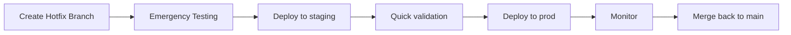

# 🚀 Complete DevOps Workflow Guide - Octonius Platform

A production-ready Terraform + GitHub Actions setup for startup environments with scalability, maintainability, and safety.

## 📁 Recommended Folder Structure

```
octonius-platform/
├── 🏗️ Infrastructure (Terraform)
│   ├── terraform/
│   │   ├── main.tf                    # Main configuration (environment-agnostic)
│   │   ├── variables.tf               # Variable definitions
│   │   ├── outputs.tf                 # Output definitions
│   │   ├── versions.tf                # Provider and Terraform version constraints
│   │   ├── backend.tf                 # Backend configuration template
│   │   ├── modules/                   # Reusable modules
│   │   │   ├── vpc/                   # VPC networking module
│   │   │   │   ├── main.tf
│   │   │   │   ├── variables.tf
│   │   │   │   └── outputs.tf
│   │   │   ├── security-groups/       # Security groups module
│   │   │   ├── ecs/                   # ECS container service
│   │   │   ├── rds/                   # Database module
│   │   │   ├── alb/                   # Application load balancer
│   │   │   └── monitoring/            # CloudWatch monitoring
│   │   ├── config/                    # Environment-specific configurations
│   │   │   ├── dev.backend.hcl        # Dev backend config
│   │   │   ├── dev.tfvars             # Dev variables
│   │   │   ├── staging.backend.hcl    # Staging backend config
│   │   │   ├── staging.tfvars         # Staging variables
│   │   │   ├── prod.backend.hcl       # Prod backend config
│   │   │   └── prod.tfvars            # Prod variables
│   │   └── policies/                  # IAM policies and security
│   │       ├── iam-roles.tf
│   │       └── security-policies.tf
│   └── scripts/
│       ├── terraform-bootstrap.sh     # State management setup
│       ├── plan-summary.sh            # Plan analysis script
│       ├── cost-estimate.sh           # Cost estimation
│       └── drift-detection.sh         # Infrastructure drift detection
│
├── 🔄 CI/CD Pipeline
│   └── .github/
│       ├── workflows/
│       │   ├── terraform.yml          # Main Terraform workflow
│       │   ├── terraform-drift.yml    # Daily drift detection
│       │   ├── cost-estimation.yml    # Cost analysis on PRs
│       │   └── security-scan.yml      # Security scanning
│       └── templates/
│           └── terraform-pr.md        # PR template with checklist
│
├── 📚 Documentation
│   ├── README.md                      # Project overview
│   ├── README-terraform.md            # Infrastructure documentation
│   ├── SECURITY.md                    # Security guidelines
│   └── CONTRIBUTING.md                # Development guidelines
│
├── 🔧 Configuration Files
│   ├── .gitignore                     # Git ignore rules
│   ├── .pre-commit-config.yaml        # Pre-commit hooks
│   ├── .terraformignore               # Terraform ignore rules
│   └── .infracost.yml                 # Cost estimation config
│
└── 📱 Application (existing)
    ├── server.ts
    ├── src/
    └── services/
```

## 🎯 Environment Strategy

### Branch-to-Environment Mapping
```yaml
Branches → Environments:
├── feature/* → dev (plan only)
├── dev       → dev (auto-deploy)
├── staging   → staging (auto-deploy)
├── main      → prod (auto-deploy with approval)
└── hotfix/*  → staging → prod (fast track)
```

### Environment Characteristics
```yaml
Development (dev):
  - Purpose: Feature development and testing
  - VPC CIDR: 10.0.0.0/16
  - Instances: Smaller (t3.micro, t3.small)
  - Single NAT Gateway: Cost optimization
  - Auto-destroy: Optional for cost savings

Staging (staging):
  - Purpose: Pre-production testing and integration
  - VPC CIDR: 10.2.0.0/16
  - Instances: Production-like sizing
  - Multiple NAT Gateways: Testing HA scenarios
  - Data: Sanitized production data

Production (prod):
  - Purpose: Live customer-facing environment
  - VPC CIDR: 10.1.0.0/16
  - Instances: Production sizing with auto-scaling
  - High Availability: Multi-AZ, multiple NAT gateways
  - Data: Real customer data with encryption
```

## 🔐 Security & Secrets Management

### GitHub Secrets Structure
```yaml
Repository Secrets:
├── AWS_ACCESS_KEY_ID          # AWS access key for Terraform
├── AWS_SECRET_ACCESS_KEY      # AWS secret key for Terraform
├── AWS_REGION                 # Default AWS region
└── SLACK_WEBHOOK_URL          # Notifications (optional)

Environment Secrets (per environment):
├── AWS_ACCOUNT_ID             # Account ID for environment
├── DB_PASSWORD                # Database passwords
├── API_KEYS                   # Third-party API keys
└── ENCRYPTION_KEYS            # Application encryption keys
```

### IAM Best Practices
```yaml
Terraform IAM User:
├── Principle of least privilege
├── Separate users per environment
├── MFA enabled for production
├── Regular key rotation (90 days)
└── CloudTrail logging enabled

Permissions:
├── S3: Full access to state buckets only
├── DynamoDB: Full access to lock tables only
├── EC2/VPC: Infrastructure management
├── IAM: Limited to service roles creation
└── CloudWatch: Logging and monitoring
```

## 🛠️ Essential Tools Integration

### Pre-commit Hooks (.pre-commit-config.yaml)
```yaml
repos:
  - repo: https://github.com/antonbabenko/pre-commit-terraform
    rev: v1.81.0
    hooks:
      - id: terraform_fmt
      - id: terraform_validate
      - id: terraform_docs
      - id: terraform_tflint
      - id: terragrunt_validate

  - repo: https://github.com/infracost/infracost
    rev: master
    hooks:
      - id: infracost_breakdown
        args: [--path=terraform]

  - repo: https://github.com/bridgecrewio/checkov
    rev: 2.4.9
    hooks:
      - id: checkov
        args: [--directory=terraform]
```

### Cost Estimation (Infracost)
```yaml
# .infracost.yml
version: 0.1
projects:
  - path: terraform
    name: octonius-infrastructure
    terraform_plan_flags: -var-file=config/prod.tfvars
```

### Linting (TFLint)
```hcl
# .tflint.hcl
plugin "aws" {
  enabled = true
  version = "0.21.0"
  source  = "github.com/terraform-linters/tflint-ruleset-aws"
}

rule "terraform_deprecated_interpolation" {
  enabled = true
}

rule "terraform_unused_declarations" {
  enabled = true
}

rule "terraform_comment_syntax" {
  enabled = true
}

rule "terraform_documented_outputs" {
  enabled = true
}

rule "terraform_documented_variables" {
  enabled = true
}
```

## 📊 Monitoring & Observability

### Drift Detection Strategy
```yaml
Daily Drift Detection:
├── Runs: Every day at 6 AM UTC
├── Compares: Current state vs. Terraform plan
├── Alerts: Slack/email on drift detected
├── Action: Creates GitHub issue with drift details
└── Scope: All environments except dev
```

### Cost Monitoring
```yaml
Cost Estimation:
├── Trigger: Every PR with infrastructure changes
├── Tool: Infracost for cost breakdown
├── Threshold: Alert if >20% cost increase
├── Display: Cost comparison in PR comments
└── Approval: Required for >$500/month increase
```

### Performance Monitoring
```yaml
Infrastructure Metrics:
├── CloudWatch: AWS resource monitoring
├── Terraform State: Size and complexity tracking
├── Deployment Time: Track infrastructure deployment duration
├── Success Rate: Monitor deployment success/failure rates
└── Resource Utilization: Cost optimization insights
```

## 🚦 Workflow Examples

### 1. Feature Development Flow

```mermaid
graph LR
    A[Create Feature Branch] --> B[Terraform Plan on PR]
    B --> C[Code Review + Plan Review]
    C --> D[Merge to dev]
    D --> E[Auto-deploy to dev]
    E --> F[Testing]
    F --> G[Merge to staging]
    G --> H[Auto-deploy to staging]
    H --> I[Integration Testing]
    I --> J[Merge to main]
    J --> K[Deploy to prod with approval]
```


### 2. Hotfix Flow


## 🎛️ Advanced Configuration

### Terragrunt for DRY Configuration
```hcl
# terragrunt.hcl (root)
remote_state {
  backend = "s3"
  generate = {
    path      = "backend.tf"
    if_exists = "overwrite_terragrunt"
  }
  config = {
    bucket         = "${local.env}-${local.project}-terraform-state-${local.region}"
    key            = "${path_relative_to_include()}/terraform.tfstate"
    region         = local.region
    encrypt        = true
    dynamodb_table = "${local.env}-${local.project}-terraform-locks"
  }
}

locals {
  env     = get_env("ENVIRONMENT", "dev")
  project = "octonius"
  region  = "eu-central-1"
}
```

### Multi-Account Strategy
```yaml
AWS Account Structure:
├── shared-services (123456789012)
│   ├── Purpose: Shared resources (CI/CD, monitoring)
│   ├── Resources: GitHub Actions runners, shared ECR
│   └── Access: Cross-account roles to other accounts

├── development (123456789013)
│   ├── Purpose: Development and testing
│   ├── Resources: Dev infrastructure
│   └── Access: Developers with full access

├── staging (123456789014)
│   ├── Purpose: Pre-production environment
│   ├── Resources: Staging infrastructure
│   └── Access: Limited developer access

└── production (123456789015)
    ├── Purpose: Customer-facing environment
    ├── Resources: Production infrastructure
    └── Access: Restricted access with approvals
```

## 🏆 Best Practices Summary

### 1. **Infrastructure as Code**
- ✅ Version control everything
- ✅ Immutable infrastructure
- ✅ Environment parity
- ✅ Automated testing

### 2. **Security First**
- ✅ Principle of least privilege
- ✅ Encrypted state storage
- ✅ Regular security scans
- ✅ Audit trails

### 3. **Cost Optimization**
- ✅ Environment-appropriate sizing
- ✅ Automated cost monitoring
- ✅ Resource tagging strategy
- ✅ Scheduled shutdowns for dev

### 4. **Reliability**
- ✅ Multi-environment testing
- ✅ Gradual rollouts
- ✅ Rollback capabilities
- ✅ Monitoring and alerting

### 5. **Developer Experience**
- ✅ Fast feedback loops
- ✅ Clear error messages
- ✅ Self-service capabilities
- ✅ Comprehensive documentation

This setup provides a robust, scalable foundation for your startup's infrastructure needs while maintaining security, cost efficiency, and developer productivity. 