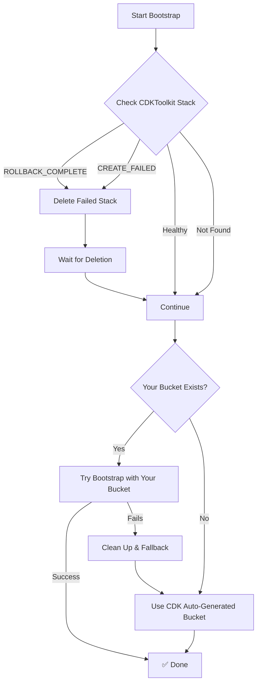

# CDK Error Handling & Bootstrap Improvements

This document explains the enhanced CDK bootstrap process that gracefully handles existing resources and common CDK errors.

## The Problem We Fixed

CDK bootstrap was failing with these common errors:

```
ROLLBACK_COMPLETE: Resource handler returned message: 
- "*** already exists (Service: S3, Status Code: 0)"
- "Tag parameters are invalid (Service: Ecr, Status Code: 400)"  
- "Error occurred during operation 'PutParameter'"
```

**Root Cause**: CDK bootstrap assumed it was creating everything from scratch, but some resources already existed or had conflicting configurations.

## The Solution

### ✅ Enhanced Bootstrap Process

The workflow now includes intelligent error handling:

1. **🔍 Pre-flight Checks**: Detects failed CDKToolkit stacks
2. **🧹 Automatic Cleanup**: Removes `ROLLBACK_COMPLETE` and failed stacks
3. **🎯 Smart Fallback**: Tries existing bucket first, falls back to auto-generated
4. **🏷️ Fixed Tags**: Uses simplified tags that pass ECR validation
5. **📋 Full Logging**: Clear visibility into what's happening

### 🔄 Bootstrap Flow



## What's Now Handled Automatically

### 🚫 S3 Bucket Conflicts
- **Before**: `*** already exists (Service: S3)` → Failure
- **After**: Tries your bucket first, falls back to CDK-generated bucket

### 🏷️ Tag Validation Issues  
- **Before**: `Tag parameters are invalid (Service: Ecr)` → Failure
- **After**: Uses simplified, ECR-compatible tags

### 🔧 Failed Stack States
- **Before**: Manual deletion required from AWS Console
- **After**: Automatically detects and cleans up failed stacks

### 📊 Parameter Conflicts
- **Before**: `Error occurred during operation 'PutParameter'` → Failure  
- **After**: Forces updates and handles existing parameters

## Manual Cleanup Tool

For existing failed stacks, use the cleanup script:

```bash
# Check what would be cleaned up
./scripts/cleanup-cdk-bootstrap.sh --dry-run

# Clean up failed CDKToolkit stack
./scripts/cleanup-cdk-bootstrap.sh

# Force cleanup without confirmation
./scripts/cleanup-cdk-bootstrap.sh --force

# Different region
./scripts/cleanup-cdk-bootstrap.sh --region us-east-1
```

### Script Features

- ✅ **Safe**: Checks stack status before acting
- ✅ **Smart**: Only deletes failed stacks, leaves healthy ones alone
- ✅ **Interactive**: Confirms actions unless `--force` is used
- ✅ **Dry-run**: Preview mode to see what would happen

## Example Workflow Run

Here's what you'll see in GitHub Actions now:

```
✅ Checking for existing CDKToolkit stack...
✅ Found failed CDKToolkit stack in state: ROLLBACK_COMPLETE. Deleting it...
✅ Waiting for stack deletion to complete...
✅ CDKToolkit stack deleted successfully
✅ Starting CDK bootstrap...
✅ Bucket dev-octonius-platform-deployment-bucket-eu-central-1 exists, bootstrapping with existing bucket...
✅ Bootstrap completed successfully with bucket: dev-octonius-platform-deployment-bucket-eu-central-1
```

Or if your bucket doesn't exist:

```
✅ Bucket dev-octonius-platform-deployment-bucket-eu-central-1 not found. Using CDK auto-generated bucket...
✅ CDK created bucket: cdk-hnb659fds-assets-123456789012-eu-central-1
✅ Bootstrap completed successfully with bucket: cdk-hnb659fds-assets-123456789012-eu-central-1
```