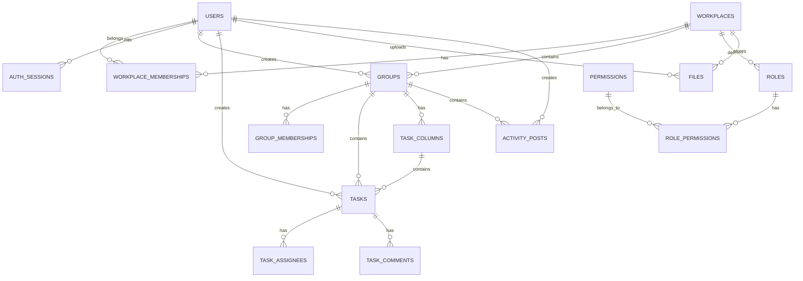
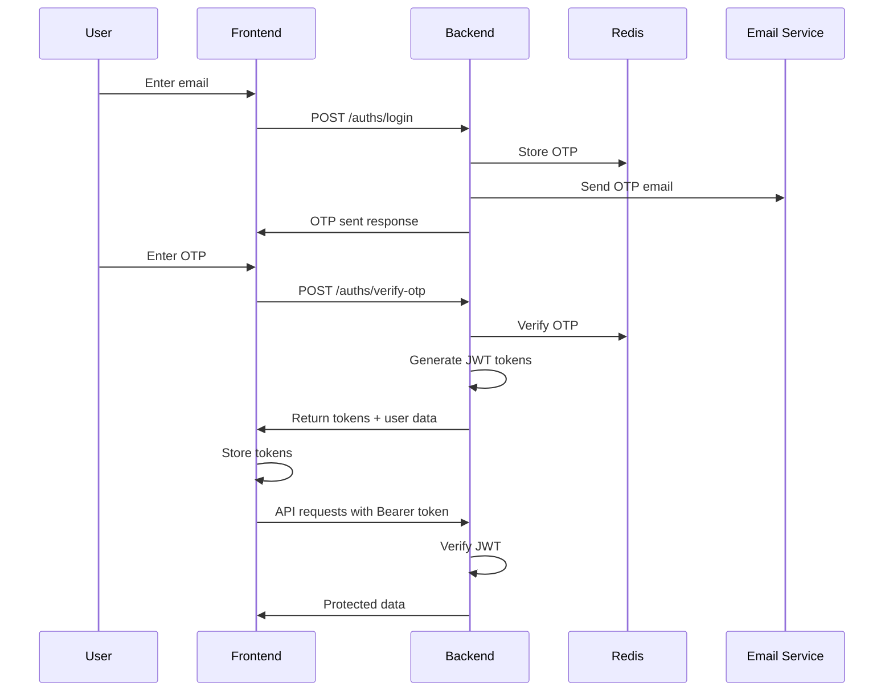
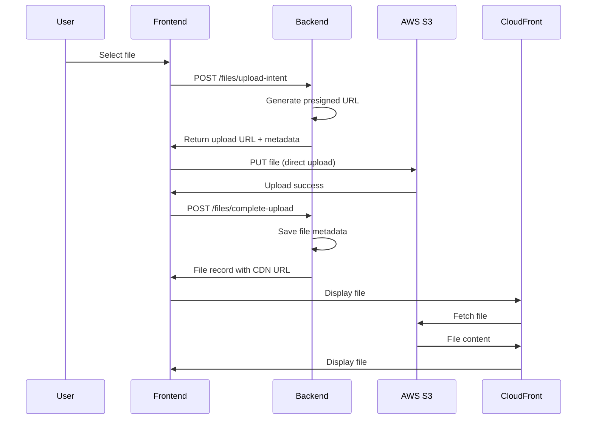
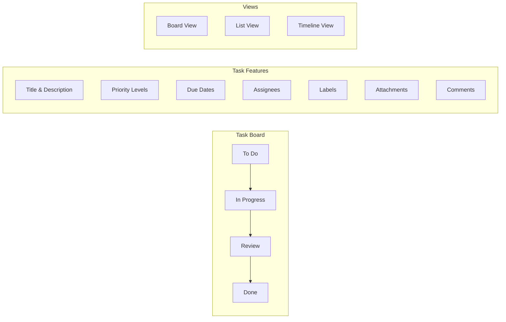

# System Architecture

## High-Level Architecture Diagram

```mermaid
graph TD
  subgraph "Frontend Layer (Angular)"
    A[Angular SPA] --> A1[Auth Module]
    A --> A2[My Space Module]
    A --> A3[Workplace Module]
    A --> A4[Shared Components]
    
    A1 --> A1a[OTP Verification]
    A1 --> A1b[Workplace Selection]
    A1 --> A1c[User Registration]
    
    A2 --> A2a[Inbox]
    A2 --> A2b[Workload]
    A2 --> A2c[Files]
    A2 --> A2d[Note Editor]
    
    A3 --> A3a[Work Management]
    A3 --> A3b[File Management]
    A3 --> A3c[Lounge]
    A3 --> A3d[Apps & CRM]
    
    A3a --> A3a1[Group Activity]
    A3a --> A3a2[Task Boards]
    A3a --> A3a3[Group Admin]
    
    A4 --> A4a[TipTap Editor]
    A4 --> A4b[Rich HTML Directive]
    A4 --> A4c[Theme Service]
    A4 --> A4d[Auth Guards]
  end
  
  subgraph "Backend Layer (Node.js/Express)"
    B[Express Server] --> B1[Auth Controller]
    B --> B2[User Controller]
    B --> B3[Workplace Controller]
    B --> B4[Group Controller]
    B --> B5[Task Controller]
    B --> B6[File Controller]
    B --> B7[Lounge Controller]
    B --> B8[Notification Controller]
    
    B --> B9[Middleware Layer]
    B9 --> B9a[Auth Middleware]
    B9 --> B9b[Request Timer]
    B9 --> B9c[Error Handler]
    B9 --> B9d[CORS & Compression]
  end
  
  subgraph "Data Layer"
    C[PostgreSQL] --> C1[Users]
    C --> C2[Workplaces]
    C --> C3[Groups]
    C --> C4[Tasks]
    C --> C5[Files]
    C --> C6[Activities]
    C --> C7[Roles & Permissions]
    
    D[Redis] --> D1[Session Storage]
    D --> D2[OTP Cache]
    D --> D3[Application Cache]
  end
  
  subgraph "Cloud Services (AWS)"
    E[S3 Bucket] --> E1[File Storage]
    E --> E2[Presigned URLs]
    
    F[CloudFront] --> F1[CDN Delivery]
    
    G[RDS PostgreSQL] --> G1[Primary Database]
    
    H[ElastiCache Redis] --> H1[Managed Redis]
    
    I[VPC] --> I1[Private Subnets]
    I --> I2[Public Subnets]
    I --> I3[NAT Gateways]
    I --> I4[Security Groups]
  end
  
  subgraph "External Services"
    J[Resend Email] --> J1[OTP Delivery]
    J --> J2[Notifications]
  end
  
  A -- "REST API" --> B
  B -- "ORM Queries" --> C
  B -- "Cache Operations" --> D
  B -- "S3 Operations" --> E
  B -- "Email Service" --> J
  E -- "CDN" --> F
  C -- "Managed Service" --> G
  D -- "Managed Service" --> H
  B -- "Network" --> I
```



## Component Architecture

### Frontend Architecture (Angular)

#### **Module Structure**
```
app/
├── modules/
│   ├── auth/                    # Authentication & onboarding
│   │   ├── login/
│   │   ├── register/
│   │   ├── verify-otp/
│   │   ├── select-workplace/
│   │   ├── create-workplace/
│   │   └── workplace-login/
│   ├── my-space/               # Personal workspace
│   │   ├── inbox/
│   │   ├── workload/
│   │   ├── files/
│   │   └── note-editor/
│   ├── workplace/              # Team workspace
│   │   ├── work-management/
│   │   │   ├── group-detail/
│   │   │   │   ├── group-activity/
│   │   │   │   ├── group-tasks/
│   │   │   │   ├── group-admin/
│   │   │   │   └── group-dashboard/
│   │   │   └── create-group-modal/
│   │   ├── lounge/
│   │   │   ├── create-story-modal/
│   │   │   └── lounge-story-detail/
│   │   ├── files/
│   │   ├── crm/
│   │   ├── communities/
│   │   └── library/
│   └── shared/                 # Reusable components
│       ├── components/
│       │   ├── navbar/
│       │   └── topbar/
│       ├── directives/
│       │   └── rich-html.directive.ts
│       └── services/
│           ├── auth.guard.ts
│           ├── workplace.guard.ts
│           └── non-auth.guard.ts
└── core/
    ├── components/
    │   └── tiptap-editor/      # Rich text editor
    ├── services/
    │   ├── auth.service.ts
    │   ├── file.service.ts
    │   ├── theme.service.ts
    │   └── toast.service.ts
    └── interceptors/
        └── auth.interceptor.ts
```

#### **Key Frontend Features**
- **Standalone Components**: Modern Angular 17+ architecture
- **Lazy Loading**: Module-based code splitting
- **Reactive Forms**: Type-safe form handling
- **Route Guards**: Authentication and authorization
- **HTTP Interceptors**: Automatic token management
- **Theme Service**: Dark/light mode switching
- **TipTap Integration**: Rich text editing everywhere

### Backend Architecture (Node.js/Express)

#### **Service Layer Structure**
```
src/
├── auths/                      # Authentication system
│   ├── auth.controller.ts
│   ├── auth.service.ts
│   ├── auth.model.ts
│   ├── auth.route.ts
│   └── auth.code.ts
├── users/                      # User management
│   ├── user.controller.ts
│   ├── user.service.ts
│   └── user.model.ts
├── workplaces/                 # Workplace management
│   ├── workplace.controller.ts
│   ├── workplace.service.ts
│   └── workplace.model.ts
├── groups/                     # Group collaboration
│   ├── group.controller.ts
│   ├── group.service.ts
│   ├── group.model.ts
│   ├── activity/              # Group activity feed
│   │   ├── activity.controller.ts
│   │   ├── activity.model.ts
│   │   └── activity.route.ts
│   └── tasks/                 # Task management
│       ├── task.controller.ts
│       ├── task.service.ts
│       ├── task.model.ts
│       ├── task-column.model.ts
│       ├── task-assignee.model.ts
│       └── task.route.ts
├── files/                      # File management
│   ├── file.controller.ts
│   ├── file.service.ts
│   ├── file.model.ts
│   └── file.route.ts
├── lounge/                     # Social features
│   ├── lounge.controller.ts
│   ├── lounge.service.ts
│   ├── lounge.model.ts
│   └── lounge.route.ts
├── notifications/              # Email system
│   ├── notification.controller.ts
│   ├── notification.service.ts
│   └── emails/
│       ├── email.ts
│       └── components/
├── middleware/                 # Express middleware
│   ├── auth.middleware.ts
│   ├── request-timer.middleware.ts
│   └── index.ts
├── shared/                     # Shared utilities
│   ├── s3.service.ts
│   ├── cache.service.ts
│   ├── handle-error.ts
│   ├── handle-response.ts
│   └── validators.ts
└── config/                     # Configuration
    ├── aws.ts
    ├── database.ts
    ├── jwt.ts
    ├── constants.ts
    └── types.ts
```

#### **Key Backend Features**
- **TypeScript**: Full type safety
- **Sequelize ORM**: Database abstraction
- **JWT Authentication**: Stateless auth with refresh tokens
- **Redis Integration**: Session and cache management
- **S3 Service**: File storage with presigned URLs
- **Email Service**: OTP and notification delivery
- **Middleware Stack**: Auth, logging, error handling
- **Validation**: Request validation with Zod

### Database Architecture

#### **Core Models & Relationships**


#### **Key Database Features**
- **UUID Primary Keys**: Globally unique identifiers
- **Soft Deletes**: Data preservation with deletion flags
- **Audit Trails**: Created/updated timestamps
- **JSON Fields**: Flexible metadata storage
- **Indexing**: Optimized query performance
- **Foreign Keys**: Referential integrity
- **Transactions**: ACID compliance

### Security Architecture

#### **Authentication Flow**


#### **Security Features**
- **OTP Authentication**: Email-based verification
- **JWT Tokens**: Access and refresh token pairs
- **Token Blacklisting**: Secure logout mechanism
- **Role-Based Access**: Granular permissions
- **Input Validation**: Request sanitization
- **CORS Protection**: Cross-origin security
- **Rate Limiting**: API abuse prevention
- **HTTPS Enforcement**: Encrypted communication

### File Management Architecture

#### **S3 Upload Flow**


#### **File Organization**
```
S3 Bucket/
├── workplaces/
│   └── {workplace-id}/
│       ├── users/
│       │   └── {user-id}/
│       │       ├── files/
│       │       │   ├── images/
│       │       │   ├── documents/
│       │       │   └── videos/
│       │       └── avatar/
│       └── groups/
│           └── {group-id}/
│               ├── files/
│               └── avatar/
└── branding/
    └── {workplace-id}/
        └── logos/
```

### Task Management Architecture

#### **Kanban Board Structure**


#### **Task Features**
- **Drag & Drop**: Visual task management
- **Multiple Views**: Board, list, timeline
- **Rich Comments**: TipTap editor integration
- **File Attachments**: S3-backed file storage
- **Time Tracking**: Estimated vs actual hours
- **Custom Fields**: Flexible metadata
- **Activity Log**: Task history tracking

### Performance Optimizations

#### **Frontend Optimizations**
- **Lazy Loading**: Module-based code splitting
- **Standalone Components**: Reduced bundle size
- **OnPush Change Detection**: Angular performance
- **Virtual Scrolling**: Large list optimization
- **Image Optimization**: Automatic compression
- **Service Workers**: Offline capabilities

#### **Backend Optimizations**
- **Database Indexing**: Query performance
- **Redis Caching**: Session and data caching
- **Connection Pooling**: Database efficiency
- **Compression**: Response size reduction
- **CDN Integration**: Global content delivery
- **S3 Direct Uploads**: Server bypass

#### **Infrastructure Optimizations**
- **Auto Scaling**: Load-based scaling
- **Load Balancing**: Traffic distribution
- **Database Read Replicas**: Read performance
- **Redis Clustering**: High availability
- **CloudFront Caching**: Global performance
- **VPC Optimization**: Network efficiency

### Monitoring & Observability

#### **Logging Strategy**
- **Winston Logger**: Structured logging
- **Request Timing**: Performance monitoring
- **Error Tracking**: Exception handling
- **Audit Logs**: Security events
- **Business Metrics**: User activity tracking

#### **Health Checks**
- **Database Connectivity**: Connection monitoring
- **Redis Health**: Cache availability
- **S3 Access**: Storage connectivity
- **Email Service**: Notification delivery
- **API Endpoints**: Service availability

### Scalability Considerations

#### **Horizontal Scaling**
- **Stateless Design**: Load balancer ready
- **Database Sharding**: Multi-tenant isolation
- **Redis Clustering**: Cache distribution
- **CDN Distribution**: Global content delivery
- **Microservices Ready**: Service decomposition

#### **Vertical Scaling**
- **Resource Optimization**: Memory and CPU usage
- **Database Optimization**: Query performance
- **Caching Strategy**: Redis utilization
- **Connection Management**: Pool optimization
- **File Storage**: S3 lifecycle management

This architecture provides a solid foundation for a modern, scalable, and maintainable collaborative platform with enterprise-grade security and performance characteristics. 