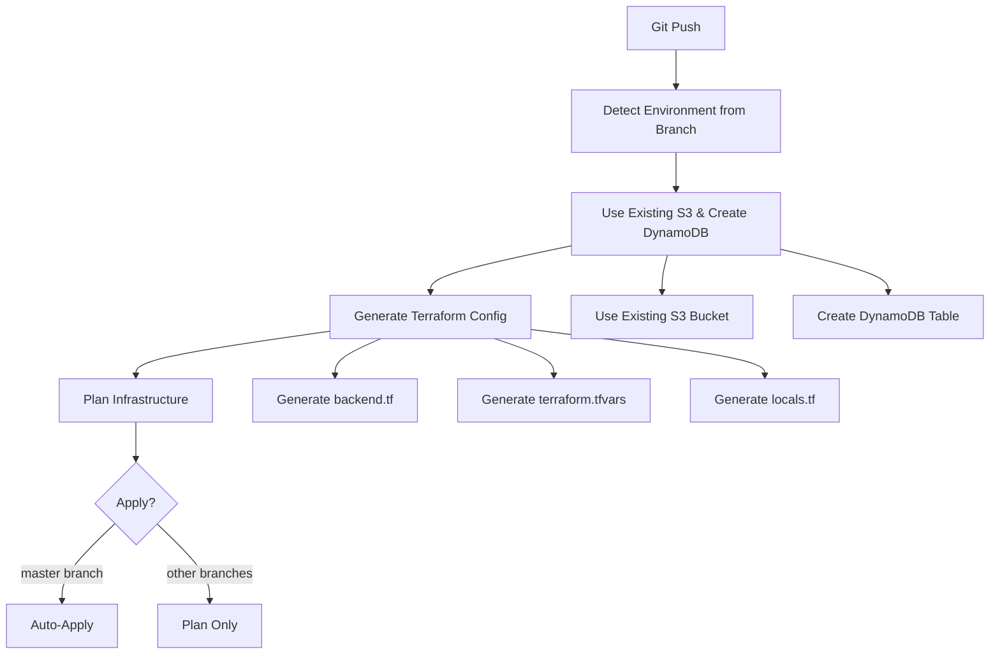

# 🏗️ 100% Pipeline-Native Terraform Infrastructure

**Zero Scripts. Zero Complexity. Just Push & Deploy.** 🚀

This is our **100% pipeline-native** infrastructure system for the Octonius Platform. Everything is computed directly in the CI/CD pipeline using standard tools with **zero external scripts**. AWS resources are auto-bootstrapped, environments are detected from branch names, and all configurations are generated on-the-fly.

## ✨ What Makes This Special

- **🔧 100% Pipeline-Native**: Zero custom scripts - everything uses standard CI/CD tools (bash, AWS CLI, Terraform)
- **🏗️ Auto-Bootstrap**: S3 buckets and DynamoDB tables created automatically on first run
- **🌿 Branch-Based Environments**: Push to any branch → automatic environment detection and deployment
- **💰 Smart Cost Optimization**: Environment-specific resource allocation (prod = HA, dev = cost-optimized, feature = minimal)
- **🔒 Secure by Default**: Encrypted state, proper networking, comprehensive tagging

## 🚀 Quick Start

### 1. Configure Environment Variables

Set these in your GitHub repository (Settings → Secrets and variables → Actions):

```bash
# Required Secrets (Secrets tab)
AWS_ACCESS_KEY      # Your AWS access key
AWS_SECRET_KEY      # Your AWS secret key
AWS_REGION          # AWS region (e.g., eu-central-1)
AWS_ACCOUNT_ID      # Your AWS account ID
DEV_S3_BUCKET       # Dev S3 bucket name
PROD_S3_BUCKET      # Prod S3 bucket name

# Required Variables (Variables tab)
AWS_ROLE_NAME       # IAM role name
DEV_CLOUDFRONT_ID   # Dev CloudFront distribution ID
PROD_CLOUDFRONT_ID  # Prod CloudFront distribution ID
REPO_NAME           # Repository name
```

### 2. Deploy Infrastructure

**That's it!** Just push to any branch:

```bash
# Deploy to production (auto-apply)
git checkout master
git push origin master

# Plan for development
git checkout development
git push origin development

# Create feature environment
git checkout -b feature/user-authentication
git push origin feature/user-authentication
```

**Everything happens automatically**:
- Environment detected from branch name
- Uses existing S3 buckets, creates DynamoDB table if needed
- Terraform configurations generated on-the-fly
- Infrastructure planned and applied

## 🌲 Branch → Environment Mapping

| Branch Pattern | Environment | Action | Infrastructure Level |
|----------------|-------------|--------|---------------------|
| `master` | `prod` | **Auto-Deploy** | High Availability (Multi-AZ, Multiple NATs) |
| `development` | `dev` | Plan Only | Cost-Optimized (Multi-AZ, Single NAT) |
| `feature/*` | `feature-{name}` | Plan Only | Minimal (Basic setup, Single NAT) |
| `hotfix/*` | `hotfix-{name}` | Plan Only | Isolated (Temporary testing) |

## 🏗️ Auto-Bootstrap Architecture

The pipeline automatically creates these resources for each environment:

### S3 State Bucket
- **Uses existing buckets** from environment variables
- **prod environment**: Uses `$PROD_S3_BUCKET`
- **dev environment**: Uses `$DEV_S3_BUCKET`
- **feature branches**: Uses `$DEV_S3_BUCKET` with different key paths

### DynamoDB Locking Table
- **Name**: `{env}-octonius-terraform-locks-{region}`
- **Purpose**: Prevents concurrent Terraform runs
- **Created**: Automatically on first deployment

### Generated Configuration Files
- **backend.tf**: Backend configuration for state storage (generated dynamically)
- **terraform.tfvars**: Environment-specific variables
- **locals.tf**: Dynamic locals with account ID, region, tags

## 🔄 How It Works



## 🎯 Environment-Specific Configurations

### Production (`master` → `prod`)
```hcl
vpc_cidr           = "10.0.0.0/16"
public_subnets     = ["10.0.1.0/24", "10.0.2.0/24"]
private_subnets    = ["10.0.10.0/24", "10.0.20.0/24"]
single_nat_gateway = false  # Multiple NATs for HA
```

### Development (`development` → `dev`)
```hcl
vpc_cidr           = "10.1.0.0/16"
public_subnets     = ["10.1.1.0/24", "10.1.2.0/24"]
private_subnets    = ["10.1.10.0/24", "10.1.20.0/24"]
single_nat_gateway = true   # Single NAT for cost optimization
```

### Feature Branches (`feature/auth` → `feature-auth`)
```hcl
vpc_cidr           = "10.{hash}.0.0/16"  # Unique CIDR per feature
public_subnets     = ["10.{hash}.1.0/24", "10.{hash}.2.0/24"]
private_subnets    = ["10.{hash}.10.0/24", "10.{hash}.20.0/24"]
single_nat_gateway = true   # Minimal cost
```

## 🛠️ Manual Deployment (If Needed)

While everything is designed to be automatic, you can deploy manually:

```bash
# Manual deployment (if needed)
ENV="prod"; case "$ENV" in prod) BUCKET="your-prod-s3-bucket" ;; *) BUCKET="your-dev-s3-bucket" ;; esac
cat > terraform/backend.tf << EOF
terraform {
  backend "s3" {
    bucket = "$BUCKET"
    key = "terraform/$ENV/terraform.tfstate"
    region = "eu-central-1"
    encrypt = true
    dynamodb_table = "$ENV-octonius-terraform-locks-eu-central-1"
  }
}
EOF
cd terraform && terraform init && terraform apply
```

## 🔐 Security Features

### State Security
- **Encryption**: All state files encrypted at rest (AES256)
- **Access Control**: IAM-based access to state resources
- **Versioning**: Full version history for rollbacks
- **Locking**: Prevents concurrent modifications

### Network Security
- **VPC Isolation**: Complete network separation per environment
- **Private Subnets**: Secure application and database tiers
- **Security Groups**: Principle of least privilege
- **NAT Gateways**: Controlled outbound internet access

### Resource Tagging
Every resource gets comprehensive tags:

```hcl
common_tags = {
  Environment = local.environment
  Project     = "octonius"
  ManagedBy   = "terraform"
  Repository  = "octonius-platform"
  Branch      = local.environment
  Account     = local.account_id
  Region      = local.aws_region
}
```

## 💰 Cost Optimization

### Smart Resource Allocation
- **Production**: High availability, redundant resources
- **Development**: Balanced cost vs. functionality  
- **Feature Branches**: Minimal viable resources

### Automatic Cost Controls
- **Environment-based scaling**: Different instance types per environment
- **Single NAT for non-prod**: Reduces NAT Gateway costs
- **Easy cleanup**: Feature environments can be destroyed easily

### Cost Monitoring
```bash
# Cost estimation runs automatically on PRs
# Shows monthly cost breakdown
# Warns if costs exceed environment thresholds
```

## 🚨 Troubleshooting

### Common Issues

**🔧 Credentials Error**
```bash
Error: AccessDenied
```
→ Check your GitHub repository secrets (AWS_ACCESS_KEY, AWS_SECRET_KEY, etc.)

**🔧 Environment Detection**
```bash
Unexpected environment name
```
→ Check branch naming (avoid special characters: @, #, etc.)

**🔧 State Bucket Issues**
```bash
Error: bucket does not exist
```
→ Check your existing S3 buckets and GitHub secrets:
- Ensure `PROD_S3_BUCKET` and `DEV_S3_BUCKET` secrets are set correctly
- Verify the buckets actually exist in your AWS account
- Check AWS permissions for S3 and DynamoDB access

### Debug Mode
```bash
export TF_LOG=DEBUG
terraform plan
```

## 🎯 Key Benefits

### ✅ **Zero Maintenance Overhead**
- No custom scripts to maintain or debug
- Standard tools only: bash, AWS CLI, Terraform
- Self-contained workflows that anyone can understand

### ✅ **Automatic Everything**
- Environment detection from branch names
- AWS resource bootstrapping
- Configuration generation
- Cost-optimized resource allocation

### ✅ **Developer-Friendly**
- Zero setup required
- Push to deploy
- Isolated environments per feature
- Automatic cleanup capabilities

### ✅ **Production-Ready**
- Encrypted state management
- Proper security controls
- Comprehensive resource tagging
- Multi-environment support

## 📊 Monitoring & Observability

### GitHub Actions Integration
- **Terraform Plans**: Visible in PR comments
- **Cost Estimates**: Automatic cost calculation
- **Drift Detection**: Daily checks for infrastructure drift
- **Deployment Summaries**: Complete deployment tracking

### AWS Integration
- **CloudTrail**: All infrastructure changes logged
- **Cost Explorer**: Tagged resources for cost tracking
- **Resource Groups**: Easy resource management by environment

## 🔄 Advanced Use Cases

### Multi-Region Deployment
```bash
# Update AWS_REGION variable in repository settings
# Push to deploy to new region - everything auto-configures
```

### Feature Environment Cleanup
```bash
# Via GitHub Actions workflow_dispatch:
# Action: "destroy"
# Environment: "feature-user-auth"
```

### Environment Promotion
```bash
# Deploy to dev first
git checkout development
git push origin development

# Review and promote to prod
git checkout master
git merge development
git push origin master  # Auto-deploys to production
```

## 📚 Additional Workflows

This repository includes three **100% pipeline-native** workflows:

1. **🏗️ terraform.yml**: Main deployment workflow
2. **💰 cost-estimation.yml**: Automatic cost calculation for PRs
3. **🔍 terraform-drift.yml**: Daily drift detection with issue creation

All workflows are self-contained with **zero external dependencies**.

## 🎯 Quick Commands

```bash
# Deploy to production
git checkout master && git push origin master

# Create feature environment  
git checkout -b feature/my-feature && git push origin feature/my-feature

# Clean up feature environment
# Use GitHub Actions workflow_dispatch with action="destroy"

# Manual deployment (if needed)
ENV="prod"; case "$ENV" in prod) BUCKET="your-prod-s3-bucket" ;; *) BUCKET="your-dev-s3-bucket" ;; esac
cat > terraform/backend.tf << EOF
terraform {
  backend "s3" {
    bucket = "$BUCKET"
    key = "terraform/$ENV/terraform.tfstate"
    region = "eu-central-1"
    encrypt = true
    dynamodb_table = "$ENV-octonius-terraform-locks-eu-central-1"
  }
}
EOF
cd terraform && terraform init && terraform apply
```

---

**🚀 100% Pipeline-Native Infrastructure**

No scripts. No complexity. No maintenance overhead.

Just push your code and watch the magic happen! ✨ 